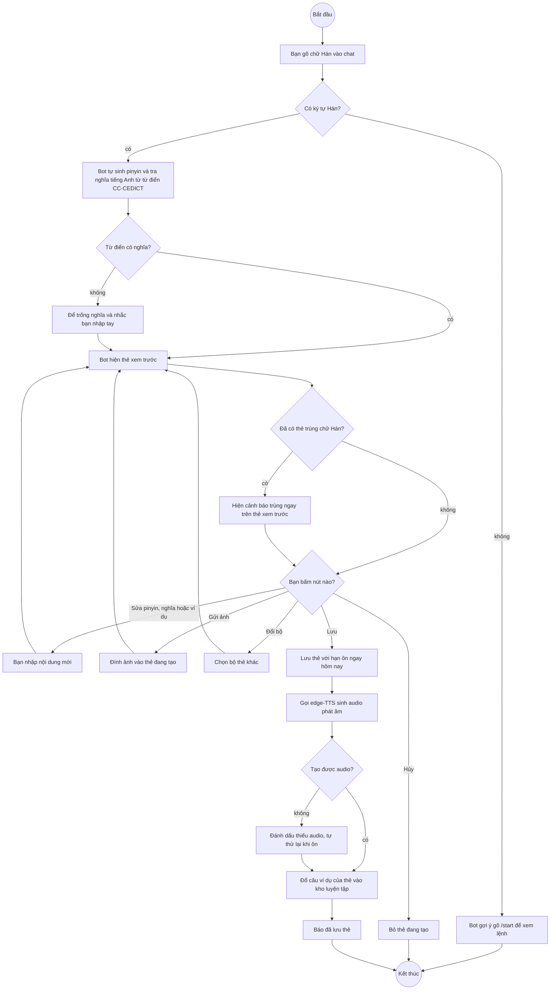
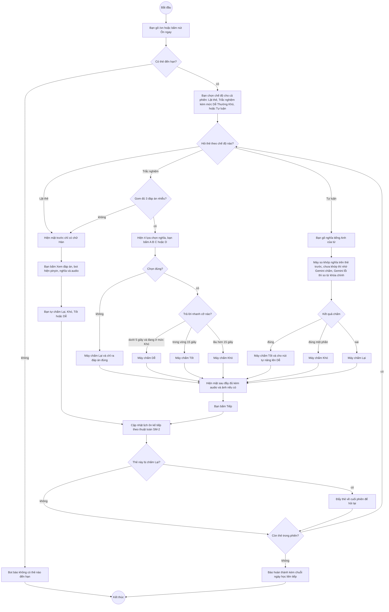
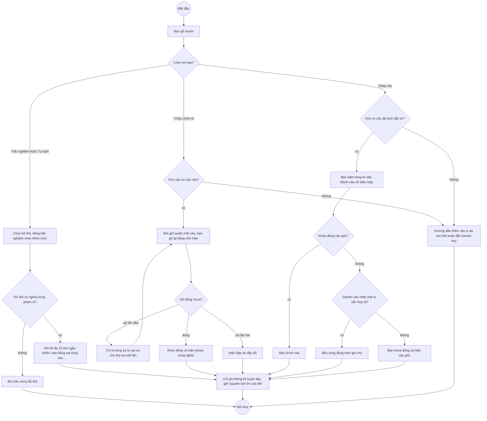
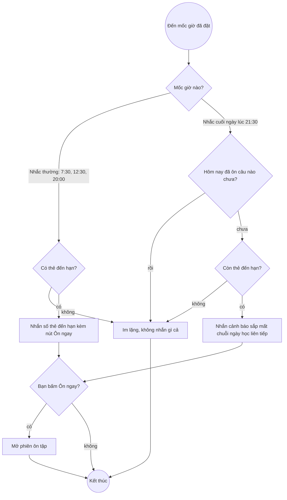
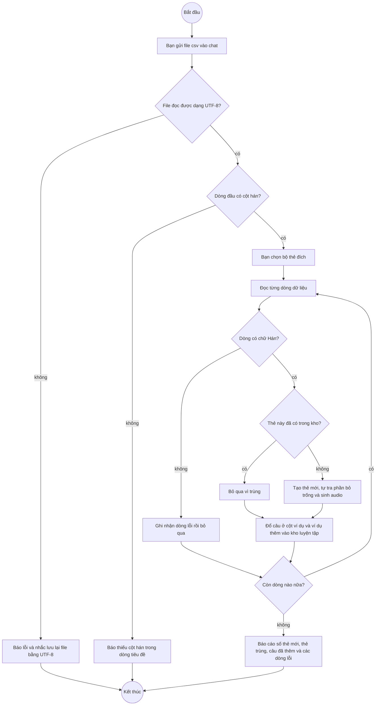

# Reminder Bot — Flows

## Flow: Tạo thẻ mới (Activity)

**Trigger**: Bạn gõ một từ tiếng Trung bất kỳ vào chat với bot.
**Related UC**: [[docs/superpowers/specs/2026-07-22-chinese-srs-telegram-bot-design.md|Spec bot SRS]]
**Related FR**: —
**Related E**: —

## Flow: Ôn tập theo lịch SM-2 (Activity)

**Trigger**: Bạn gõ `/on`, hoặc bấm nút Ôn ngay trong tin nhắn nhắc.
**Related UC**: [[docs/superpowers/specs/2026-07-23-practice-modes-design.md|Spec chế độ luyện tập]]
**Related FR**: —
**Related E**: —

## Flow: Luyện tự do (Activity)

**Trigger**: Bạn gõ `/luyen` — mọi kết quả ở đây không tác động tới lịch ôn SM-2.
**Related UC**: [[docs/superpowers/specs/2026-07-23-practice-modes-design.md|Spec chế độ luyện tập]]
**Related FR**: —
**Related E**: —

## Flow: Nhắc học theo giờ (Activity)

**Trigger**: Đồng hồ trong bot chạy tới mốc giờ đã đặt trong `/settings`.
**Related UC**: [[docs/superpowers/specs/2026-07-22-chinese-srs-telegram-bot-design.md|Spec bot SRS]]
**Related FR**: —
**Related E**: —

## Flow: Nhập thẻ hàng loạt từ CSV (Activity)

**Trigger**: Bạn gửi file `.csv` vào chat với bot.
**Related UC**: [[docs/superpowers/specs/2026-07-23-practice-modes-design.md|Spec chế độ luyện tập]]
**Related FR**: —
**Related E**: —

